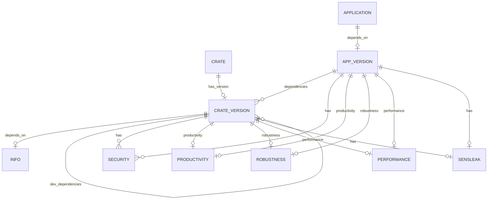

# Database Design for crates.pro 

## Graph Model Design for TuGraph

### Storage Structure Design Goals

Our aim is to create a graph database model that effectively represents the dependency relationships between crates and their versions within Rust's package management system in TuGraph. This model is designed to tackle two core issues:
- **Storage**: Represent crates and their version information. This is achieved by distinguishing between crate metadata and specific version information through two types of nodes (CrateMaster and CrateVersion).
- **Computation**: Track dependencies. Dependencies between different crate versions are represented using edges, allowing for the tracking and querying of whether a version of a crate directly or indirectly depends on a specific version of another crate.


### Edge Design

- **has_version**:
  - Direction: From CrateMaster to CrateVersion.
  - Description: Represents the version nodes owned by a crate master node.
  - Attributes may be none or only include version release sequence information (for easy traversal).
- **depends_on**:
  - Direction: From one CrateVersion to another CrateVersion.
  - Description: Represents that a version of a crate depends on a specific version of another crate.
  - Attributes:
    - dependency_type: String, the type of dependency, e.g., dev, build, regular.
    - optional: Boolean, whether this dependency is optional.
    - default_features: Boolean, whether the default features of the dependency are used.
    - features: String Array, a list of activated features.
- **updated_to**:
  - Direction: From an older version to a newer version.
  - Description:
    - By traversing the updated_to edges, we can efficiently query the complete update history of any version of a crate.
    - The newest version can be quickly located by finding the CrateVersion node that does not have an updated_to outgoing edge, which is more direct and efficient than comparing dates or version number strings.
    - When a new version is released, it only requires adding a new CrateVersion node and establishing an updated_to edge towards it. This change can trigger a notification mechanism to inform all users subscribed to updates from the old version.
  - Attributes:
    - updated_date: The date of the update, recording the release date of the new version
    - change_log: Optional, records the main changes summary from the previous version to the current version

---

## ER Diagram for PostgreSQL

### Table Overview

| Table Name    | Description                                                              |
|---------------|--------------------------------------------------------------------------|
| crate         | Crate from Rust community registry - crates.io                           |
| crate_version | Crate published specification version                                    |
| info          | Crate general information                                                |
| application   | Application developed by Rust                                            |
| app_version   | Application tags                                                         |
| security      | Security Advisories                                                      |
| sensleak      | Sensitive data, specifically targeting sensitive information within code |
| productivity  | Productivity data from oss-compass                                       |
| robustness    | Robustness data from oss-compass                                         |
| performance   | Performance test data                                                    |

### ER Diagram



### Table Details

#### program

| Column        | Type         | Constraints | Description                                         |
|---------------|--------------|-------------|-----------------------------------------------------|
| id            | BIGINT       | PRIMARY KEY |                                                     |
| name          | VARCHAR(255) | NOT NULL    |                                                     |
| namespace     | VARCHAR(255) | NULL        |                                                     |
| repository    | TEXT         | NULL        | The git repository url from GitHub or other service |
| categories    | TEXT         | NULL        |                                                     |
| keywords      | TEXT         | NULL        |                                                     |
| documentation | String       | NULL        |                                                     |

#### library

| Column        | Type         | Constraints | Description                                         |
|---------------|--------------|-------------|-----------------------------------------------------|
| id            | BIGINT       | PRIMARY KEY |                                                     |
| download      | BIGINT       | NOT NULL    | The download count from crates.io                   |
| cratesio_web  | VARCHAR(255) | NOT NULL    | Default registry is crates.io                       |


#### application

| Column        | Type         | Constraints | Description                                         |
|---------------|--------------|-------------|-----------------------------------------------------|
| id            | BIGINT       | PRIMARY KEY |                                                     |
| repository    | TEXT         | NULL        | The git repository url from GitHub or other service |
| name          | VARCHAR(255) | NOT NULL    |                                                     |

#### library_version

| Column        | Type         | Constraints | Description                          |
|---------------|--------------|-------------|--------------------------------------|
| id            | BIGINT       | PRIMARY KEY |                                      |
| crate_id      | BIGINT       | NOT NULL    |                                      |
| version       | VARCHAR(255) | NOT NULL    |                                      |
| documentation | String       | NULL        |  Different version has different doc |
| license       | VARCHAR(255) | NOT NULL    |                                      |
| sloc          | BIGINT       | NOT NULL    | Source lines of code                 |
| dep_sloc      | BIGINT       | NOT NULL    | Source lines of code of dependencies |
| features      | TEXT         | NULL        | Cargo features                       |
| sbom          | TEXT         | NULL        | Software Bill of Materials           |


#### app_version

| Column     | Type      | Constraints | Description |
|------------|-----------|-------------|-------------|
| id         | BIGINT    | PRIMARY KEY |             |
| app_id     | BIGINT    | NOT NULL    |             |


#### version

| Column     | Type      | Constraints | Description |
|------------|-----------|-------------|-------------|
| id         | BIGINT    | PRIMARY KEY |             |
| app_id     | BIGINT    | NOT NULL    |             |
| created_at | TIMESTAMP | NOT NULL    |             |
| updated_at | TIMESTAMP | NOT NULL    |             |


#### security

| Column     | Type      | Constraints | Description |
|------------|-----------|-------------|-------------|
| id         | BIGINT    | PRIMARY KEY |             |
| app_id     | BIGINT    | NULL        |             |
| version_id | BIGINT    | NULL        |             |
| created_at | TIMESTAMP | NOT NULL    |             |
| updated_at | TIMESTAMP | NOT NULL    |             |


#### productivity

| Column       | Type       | Constraints | Description |
|--------------|------------|-------------|-------------|
| id           | BIGINT     | PRIMARY KEY |             |
| app_id       | BIGINT     | NULL        |             |
| version_id   | BIGINT     | NULL        |             |
| created_at   | TIMESTAMP  | NOT NULL    |             |
| updated_at   | TIMESTAMP  | NOT NULL    |             |

#### robustness

| Column     | Type      | Constraints | Description |
|------------|-----------|-------------|-------------|
| id         | BIGINT    | PRIMARY KEY |             |
| app_id     | BIGINT    | NULL        |             |
| version_id | BIGINT    | NULL        |             |
| created_at | TIMESTAMP | NOT NULL    |             |
| updated_at | TIMESTAMP | NOT NULL    |             |

#### performance

| Column     | Type      | Constraints | Description |
|------------|-----------|-------------|-------------|
| id         | BIGINT    | PRIMARY KEY |             |
| app_id     | BIGINT    | NULL        |             |
| version_id | BIGINT    | NULL        |             |
| created_at | TIMESTAMP | NOT NULL    |             |
| updated_at | TIMESTAMP | NOT NULL    |             |

#### sensleak

| Column     | Type      | Constraints | Description |
|------------|-----------|-------------|-------------|
| id         | BIGINT    | PRIMARY KEY |             |
| app_id     | BIGINT    | NULL        |             |
| version_id | BIGINT    | NULL        |             |
| created_at | TIMESTAMP | NOT NULL    |             |
| updated_at | TIMESTAMP | NOT NULL    |             |


### Usage

#### Deploy Tugraph

**note: in our test server, tugraph has been set up.**

1. install tugraph [1]
    - download package: `wget https://github.com/TuGraph-family/tugraph-db/releases/download/xxxxxx.deb`
    - install it: `sudo dpkg -i tugraph-x.y.z.deb`
2. checkout root user: `sudo su`
3. `export LD_LIBRARY_PATH=/usr/local/lib64`
4. start the tugraph server: `lgraph_server -d start --directory ./lgraph_db`
5. check by typing `htop` and search for `lgraph_server`, and you will find 


#### Import Data

**note: in current version, crates-pro can import data automaticly, we dont need import manually.**

In real-machine, type: 

```
lgraph_import -c import.conf --dir ./lgraph_db --graph cratespro
```

If the graph `cratespro` exists, it will exit. To force to cover the graph, use `--overwrite true`.

```bash
rust@rust-PowerEdge-R750xs:~$ lgraph_import -c /home/rust/crates-pro/import.config --dir ./lgraph_db --graph cratespro --overwrite true
[20240709 03:16:48.268758 0x000079af9b5c4900 INFO  toolkits/lgraph_import.cpp:277] Importing FROM SCRATCH:
        from:                 /home/rust/crates-pro/import.config
        to:                   ./lgraph_db
        verbose:              1
        log_dir:
        keep_vid_in_memory:   true
        parse_file_threads:   21
        parse_block_threads:  21
        parse_block_size:     8388608
        generate_sst_threads: 64
        read_rocksdb_threads: 64
        vid_num_per_reading:  10000
        max_size_per_reading: 33554432
[20240709 03:16:48.278103 0x000079af9b5c4900 INFO  src/import/import_v3.cpp:1454] Graph already exists, all the data in the graph will be overwritten.
[20240709 03:16:48.279139 0x000079af9b5c4900 INFO  src/import/import_v3.cpp:107] Add vertex label:program
[20240709 03:16:48.279256 0x000079af9b5c4900 INFO  src/import/import_v3.cpp:107] Add vertex label:library
[20240709 03:16:48.279581 0x000079af9b5c4900 INFO  src/import/import_v3.cpp:107] Add vertex label:application
[20240709 03:16:48.279725 0x000079af9b5c4900 INFO  src/import/import_v3.cpp:107] Add vertex label:library_version
[20240709 03:16:48.279831 0x000079af9b5c4900 INFO  src/import/import_v3.cpp:107] Add vertex label:application_version
[20240709 03:16:48.279899 0x000079af9b5c4900 INFO  src/import/import_v3.cpp:107] Add vertex label:version
[20240709 03:16:48.279978 0x000079af9b5c4900 INFO  src/import/import_v3.cpp:107] Add edge label:has_type
[20240709 03:16:48.280042 0x000079af9b5c4900 INFO  src/import/import_v3.cpp:107] Add edge label:has_version
[20240709 03:16:48.280608 0x000079af9b5c4900 INFO  src/import/import_v3.cpp:107] Add edge label:has_dep_version
[20240709 03:16:48.280746 0x000079af9b5c4900 INFO  src/import/import_v3.cpp:107] Add edge label:depends_on
[20240709 03:16:48.401801 0x000079af9b5c4900 INFO  src/import/import_v3.cpp:512] Convert vertex data to sst files, time: 0.120869s
[20240709 03:16:48.707510 0x000079af9b5c4900 INFO  src/import/import_v3.cpp:876] Convert edge data to sst files, time: 0.30536s
[20240709 03:16:48.787741 0x000079af9b5c4900 INFO  src/import/import_v3.cpp:1033] Write vertex primary index to lmdb, time: 0.0799625s
[20240709 03:16:48.871486 0x000079af9b5c4900 INFO  src/import/import_v3.cpp:1410] Dump rocksdb into lmdb, time: 0.0820558s
[20240709 03:16:48.879749 0x000079af9b5c4900 INFO  src/import/import_v3.cpp:216] Import finished in 0.603474 seconds.
```

#### Steps

1. open dev-containers and wait for compiling.
2. you can test TuGraph Server.
    - In real-machine, run `netstat -tuln | grep -E '7687|7070'` to check if it successes. The terminal will show 
      ```
      tcp        0      0 0.0.0.0:7687            0.0.0.0:*               LISTEN     
      tcp        0      0 0.0.0.0:7070            0.0.0.0:*               LISTEN 
      ```
    - In docker, run `cargo test --all  -- --test-threads=1` to test it.
4. Then, you can code and test it.
    - The bolt port is 7687, and HTTP port is 7070
    - Open http://localhost:7070 (the ip varies) in your browser. The username is `admin`, and the password is `73@TuGraph`.
5. `cargo test` to run all the tests.

#### reset MQ
```
docker exec pensive_villani /opt/kafka/bin/kafka-consumer-groups.sh --bootstrap-server localhost:9092 --group defau
lt_group --reset-offsets --to-offset 0 --execute --topic REPO_SYNC_STATUS.dev
```
#### export 

` export HOST_PASSWORD=xxxxx`


### note(chinese)


#### Version Parsing
Iterate through the tags to find the version in Cargo.toml
1. there may be errors in the version, e.g. 0.15.2a3, which doesn't match the semver format.
2. Multiple tags may correspond to a single version specified in Cargo.toml, so de-duplication is needed.
3. version b of a dependency may be upgraded, so a reverse_dependency_map is made, and each time a new version is added, it checks that it will not replace the other.

**Reversing dependencies**
1. first find dependencies for yourself
    - Insert all the dependencies into reverse_map.
    - Call search to find matching dependencies. 2.
2. then update the dependencies on this new node, there may be previous dependencies, then update; no dependencies on the addition of the
    - If there is a dependency on another version, remove it.
    - If there is a dependency on another version, remove it.


## tugraph return json


program
```
{"identity":17679,"label":"program","properties":{"description":"None","doc_url":"null","github_url":"null","id":"00022c9b-217c-4d8d-8859-85ce6d5f9e31","max_version":"0.0.0","mega_url":"null","name":"imessage-database","namespace":"null"}}
```

### Reference
[1] https://tugraph-db.readthedocs.io/zh-cn/v4.0.0/5.developer-manual/1.installation/4.local-package-deployment.html