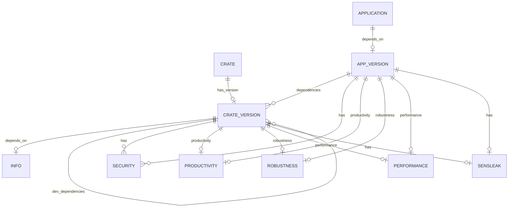

# Database Design for crates.pro 

## Graph Model Design for TuGraph

### Storage Structure Design Goals

Our aim is to create a graph database model that effectively represents the dependency relationships between crates and their versions within Rust's package management system in TuGraph. This model is designed to tackle two core issues:
- **Storage**: Represent crates and their version information. This is achieved by distinguishing between crate metadata and specific version information through two types of nodes (CrateMaster and CrateVersion).
- **Computation**: Track dependencies. Dependencies between different crate versions are represented using edges, allowing for the tracking and querying of whether a version of a crate directly or indirectly depends on a specific version of another crate.

### Node Design

- **CrateMaster**: Represents a master node of a crate, storing metadata related to the crate.
  - Attributes:
    - crate_name: String, the name of the crate.
    - description: String, a brief introduction or description of the crate.
    - repository_url: String, the source code repository URL of the crate.
    - license: String, indicates the license of the crate.
  - Usage: Allows users to query the master node by crate name, obtaining an overview of the crate.
- **CrateVersion**: Represents a specific version of a crate, containing information unique to that version.
  - Attributes:
    - version: String, the version number of this crate version.
    - deps_spec: String, the specification of dependencies for this version, which can be a version number or a range.
    - published_date: DateTime, the release date of the version.
    - features: String Array, a list of features for this crate version.
    - ...
  - Usage: Stores detailed information for each version, supporting identification of subtle differences between versions.

### Edge Design

- **has_version**:
  - Direction: From CrateMaster to CrateVersion.
  - Description: Represents the version nodes owned by a crate master node.
  - Attributes may be none or only include version release sequence information (for easy traversal).
- **depends_on**:
  - Direction: From one CrateVersion to another CrateVersion.
  - Description: Represents that a version of a crate depends on a specific version of another crate.
  - Attributes:
    - dependency_type: String, the type of dependency, e.g., dev, build, regular.
    - optional: Boolean, whether this dependency is optional.
    - default_features: Boolean, whether the default features of the dependency are used.
    - features: String Array, a list of activated features.
- **updated_to**:
  - Direction: From an older version to a newer version.
  - Description:
    - By traversing the updated_to edges, we can efficiently query the complete update history of any version of a crate.
    - The newest version can be quickly located by finding the CrateVersion node that does not have an updated_to outgoing edge, which is more direct and efficient than comparing dates or version number strings.
    - When a new version is released, it only requires adding a new CrateVersion node and establishing an updated_to edge towards it. This change can trigger a notification mechanism to inform all users subscribed to updates from the old version.
  - Attributes:
    - updated_date: The date of the update, recording the release date of the new version
    - change_log: Optional, records the main changes summary from the previous version to the current version

---

## ER Diagram for PostgreSQL

### Table Overview

| Table Name    | Description                                                              |
|---------------|--------------------------------------------------------------------------|
| crate         | Crate from Rust community registry - crates.io                           |
| crate_version | Crate published specification version                                    |
| info          | Crate general information                                                |
| application   | Application developed by Rust                                            |
| app_version   | Application tags                                                         |
| security      | Security Advisories                                                      |
| sensleak      | Sensitive data, specifically targeting sensitive information within code |
| productivity  | Productivity data from oss-compass                                       |
| robustness    | Robustness data from oss-compass                                         |
| performance   | Performance test data                                                    |

### ER Diagram

### Table Details

#### crate

| Column        | Type         | Constraints | Description                                         |
|---------------|--------------|-------------|-----------------------------------------------------|
| id            | BIGINT       | PRIMARY KEY |                                                     |
| name          | VARCHAR(255) | NOT NULL    |                                                     |
| namespace     | VARCHAR(255) | NULL        |                                                     |
| repository    | TEXT         | NULL        | The git repository url from GitHub or other service |
| documentation | TEXT         | NULL        | The documentation url                               |
| categories    | TEXT         | NULL        |                                                     |
| keywords      | TEXT         | NULL        |                                                     |
| download      | BIGINT       | NOT NULL    | The download count from crates.io                   |
| registry      | VARCHAR(255) | NOT NULL    | Default registry is crates.io                       |
| created_at    | TIMESTAMP    | NOT NULL    |                                                     |
| updated_at    | TIMESTAMP    | NOT NULL    |                                                     |

#### crate_version

| Column     | Type         | Constraints | Description                          |
|------------|--------------|-------------|--------------------------------------|
| id         | BIGINT       | PRIMARY KEY |                                      |
| crate_id   | BIGINT       | NOT NULL    |                                      |
| version    | VARCHAR(255) | NOT NULL    |                                      |
| license    | VARCHAR(255) | NOT NULL    |                                      |
| sloc       | BIGINT       | NOT NULL    | Source lines of code                 |
| dep_sloc   | BIGINT       | NOT NULL    | Source lines of code of dependencies |
| features   | TEXT         | NULL        | Cargo features                       |
| sbom       | TEXT         | NULL        | Software Bill of Materials           |
| created_at | TIMESTAMP    | NOT NULL    |                                      |
| updated_at | TIMESTAMP    | NOT NULL    |                                      |

#### info

| Column        | Type         | Constraints | Description |
|---------------|--------------|-------------|-------------|
| id            | BIGINT       | PRIMARY KEY |             |
| version_id    | BIGINT       | NOT NULL    |             |
| edition       | VARCHAR(255) | NULL        |             |
| description   | TEXT         | NULL        |             |
| authors       | TEXT         | NULL        |             |
| size          | BIGINT       | NOT NULL    |             |
| created_at    | TIMESTAMP    | NOT NULL    |             |
| updated_at    | TIMESTAMP    | NOT NULL    |             |

#### application

| Column        | Type         | Constraints | Description                                         |
|---------------|--------------|-------------|-----------------------------------------------------|
| id            | BIGINT       | PRIMARY KEY |                                                     |
| repository    | TEXT         | NULL        | The git repository url from GitHub or other service |
| documentation | TEXT         | NULL        | The documentation url                               |
| name          | VARCHAR(255) | NOT NULL    |                                                     |
| created_at    | TIMESTAMP    | NOT NULL    |                                                     |
| updated_at    | TIMESTAMP    | NOT NULL    |                                                     |

#### app_version

| Column     | Type      | Constraints | Description |
|------------|-----------|-------------|-------------|
| id         | BIGINT    | PRIMARY KEY |             |
| app_id     | BIGINT    | NOT NULL    |             |
| created_at | TIMESTAMP | NOT NULL    |             |
| updated_at | TIMESTAMP | NOT NULL    |             |

#### security

| Column     | Type      | Constraints | Description |
|------------|-----------|-------------|-------------|
| id         | BIGINT    | PRIMARY KEY |             |
| app_id     | BIGINT    | NULL        |             |
| version_id | BIGINT    | NULL        |             |
| created_at | TIMESTAMP | NOT NULL    |             |
| updated_at | TIMESTAMP | NOT NULL    |             |

#### productivity

| Column       | Type       | Constraints | Description |
|--------------|------------|-------------|-------------|
| id           | BIGINT     | PRIMARY KEY |             |
| app_id       | BIGINT     | NULL        |             |
| version_id   | BIGINT     | NULL        |             |
| created_at   | TIMESTAMP  | NOT NULL    |             |
| updated_at   | TIMESTAMP  | NOT NULL    |             |

#### robustness

| Column     | Type      | Constraints | Description |
|------------|-----------|-------------|-------------|
| id         | BIGINT    | PRIMARY KEY |             |
| app_id     | BIGINT    | NULL        |             |
| version_id | BIGINT    | NULL        |             |
| created_at | TIMESTAMP | NOT NULL    |             |
| updated_at | TIMESTAMP | NOT NULL    |             |

#### performance

| Column     | Type      | Constraints | Description |
|------------|-----------|-------------|-------------|
| id         | BIGINT    | PRIMARY KEY |             |
| app_id     | BIGINT    | NULL        |             |
| version_id | BIGINT    | NULL        |             |
| created_at | TIMESTAMP | NOT NULL    |             |
| updated_at | TIMESTAMP | NOT NULL    |             |

#### sensleak

| Column     | Type      | Constraints | Description |
|------------|-----------|-------------|-------------|
| id         | BIGINT    | PRIMARY KEY |             |
| app_id     | BIGINT    | NULL        |             |
| version_id | BIGINT    | NULL        |             |
| created_at | TIMESTAMP | NOT NULL    |             |
| updated_at | TIMESTAMP | NOT NULL    |             |