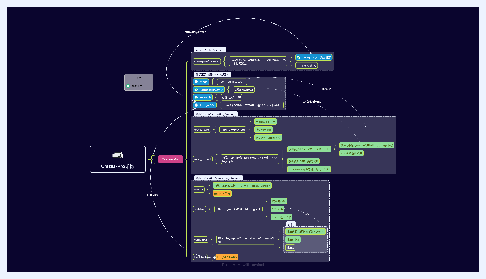

# Crates-Pro技术文档

## 介绍

CratesPro 是一个用于分析 Rust crates 的平台，旨在追踪所有 Rust crates 版本的依赖关系，从而监控漏洞的传播。该平台还支持对新上传版本进行实时分析和图数据库更新。以下是 CratesPro 的架构及其技术路线和功能介绍。

### 功能介绍
- 数据同步: 通过 Kafka 消息队列，实现与 Mega 仓库的自动同步，确保平台数据的完整性和时效性。

- 数据存储与访问: 使用 Tugraph 进行数据存储，并通过 Postgres 数据库提供前端访问接口，实现前后端的解耦。

- 依赖追踪: 通过对 crate 及其版本的建模，CratesPro 能够追踪每个 crate 的依赖关系，帮助识别和监控漏洞的传播路径。（已实现，目前在前端实现，需要优化为TuGraph实现，存入PG）

- 实时分析: 对于新上传的版本，CratesPro 能够实时进行分析，并更新数据库，确保数据的及时性。

- 用户界面: 提供直观的用户界面，方便用户查询和分析 crates 的依赖关系和漏洞信息。这个在 [cratespro-frontend](https://github.com/crates-pro/cratespro-frontend) 里面。


## 架构

### 架构图



### 控制模块

CoreController 模块通过异步任务管理三个主要线程：

- 数据导入线程：从 Kafka 消息队列接收消息，解析并导入到 Tugraph。它会在共享状态允许时运行，确保不与打包任务冲突。

- 数据分析线程：负责分析导入的数据，确保在打包任务未进行时执行。

- 数据打包线程：定期将数据打包并传输到指定位置。该线程会锁定共享状态以避免其他任务干扰。

这些任务通过 tokio 异步运行，使用 Mutex 来同步共享状态，确保任务之间的协调与互斥。

### 模块划分

- model: 对于一个crate及其版本进行建模。
  - general_model: 在对crate进行分析时候的模型，与Tugraph无关。
  - repo_sync_model: 从Kafka导入数据的格式，一个message代表一个Model实例。
  - tugraph_model: 导入和导出tugraph的模型，对应了Tugraph的模型，repo_import将其写为json格式。具体的tugraph的数据结构可以参考import.config.tmp。
- repo_import: 数据导入模块，Mega在消息队列中发送消息，告诉crates-pro哪个仓库有更新，该模块读取信息，然后下载该仓库，对仓库信息进行解析。目前是自动化解析之后会把导入文件写入tugraph_import_files_mq，然后把import.config放进去，手动导入，具体导入方式参考TuGraph文档。目前服务器设置的Tugraph中也有一个cratespro数据库。
  - kafka_handler: Kafka消息队列读取模块，封装了kafka。
  - git: 封装了从mega（可以理解成github）下载仓库的代码，以及其他git操作。
  - crate_info: 解析crate的基本信息。对应于Tugraph中的Program、Library、Application结构。目前只解析了基本的信息，还有一些需要扩展。
  - version_info: 解析crate每个版本的基本信息。对应于Tugraph中的LibraryVersion、ApplicationVersion、Version这些结构。同样地，还有一些需要扩展

- data_transporter: 作为前端和后端连接的桥梁。对于前端部署，我们的思路是，后端解析和计算出一些信息，存入Postgres数据库，然后前端从PG中读取数据。这样分离前后端，前端可以不依赖后端的服务器。
  - data_reader: 从Tugraph中读取和计算相关信息（这是因为在import的时候，我们将数据存入Tugraph之中）。
  - data_packer: 将data_reader中读取的存入PG数据库。
  - transporter: 控制器。
- tudriver: 我封装的Tugraph的bolt客户端，可以连接并执行Tugraph的操作。可以发送Cypher请求，基本用法可以参考data_reader.rs。


## 使用说明

#### 1. 部署 Tugraph

**注意：在我们的测试服务器上，Tugraph 已经设置好了。**

1. 安装 Tugraph [1]
   - 下载软件包：`wget https://github.com/TuGraph-family/tugraph-db/releases/download/xxxxxx.deb`
   - 安装：`sudo dpkg -i tugraph-x.y.z.deb`
2. 切换到 root 用户：`sudo su`
3. 设置环境变量：`export LD_LIBRARY_PATH=/usr/local/lib64`
4. 启动 Tugraph 服务器：`lgraph_server -d start --directory ./lgraph_db`
5. 通过输入 `htop` 并搜索 `lgraph_server` 检查，应该能看到相关进程。

#### 导入数据

**注意：在当前版本中，crates-pro 的repo_import每次解析一个仓库，就会更新一次导入文件，参考repo_import的lib.rs，但是需要手动导入**

在服务器上，输入：

```bash
lgraph_import -c import.conf --dir ./lgraph_db --graph cratespro
```

如果图 `cratespro` 已存在，它将退出。要强制覆盖图，使用 `--overwrite true`。

```bash
rust@rust-PowerEdge-R750xs:~$ lgraph_import -c /home/rust/crates-pro/import.config --dir ./lgraph_db --graph cratespro --overwrite true
[20240709 03:16:48.268758 0x000079af9b5c4900 INFO  toolkits/lgraph_import.cpp:277] 从头开始导入：
        来源：                 /home/rust/crates-pro/import.config
        目标：                 ./lgraph_db
        详细程度：              1
        日志目录：
        内存中保留 vid：   true
        解析文件线程数：   21
        解析块线程数：     21
        解析块大小：       8388608
        生成 sst 线程数： 64
        读取 rocksdb 线程数： 64
        每次读取的 vid 数量：  10000
        每次读取的最大大小： 33554432
[20240709 03:16:48.278103 0x000079af9b5c4900 INFO  src/import/import_v3.cpp:1454] 图已存在，图中的所有数据将被覆盖。
[20240709 03:16:48.279139 0x000079af9b5c4900 INFO  src/import/import_v3.cpp:107] 添加顶点标签：program
[20240709 03:16:48.279256 0x000079af9b5c4900 INFO  src/import/import_v3.cpp:107] 添加顶点标签：library
[20240709 03:16:48.279581 0x000079af9b5c4900 INFO  src/import/import_v3.cpp:107] 添加顶点标签：application
[20240709 03:16:48.279725 0x000079af9b5c4900 INFO  src/import/import_v3.cpp:107] 添加顶点标签：library_version
[20240709 03:16:48.279831 0x000079af9b5c4900 INFO  src/import/import_v3.cpp:107] 添加顶点标签：application_version
[20240709 03:16:48.279899 0x000079af9b5c4900 INFO  src/import/import_v3.cpp:107] 添加顶点标签：version
[20240709 03:16:48.279978 0x000079af9b5c4900 INFO  src/import/import_v3.cpp:107] 添加边标签：has_type
[20240709 03:16:48.280042 0x000079af9b5c4900 INFO  src/import/import_v3.cpp:107] 添加边标签：has_version
[20240709 03:16:48.280608 0x000079af9b5c4900 INFO  src/import/import_v3.cpp:107] 添加边标签：has_dep_version
[20240709 03:16:48.280746 0x000079af9b5c4900 INFO  src/import/import_v3.cpp:107] 添加边标签：depends_on
[20240709 03:16:48.401801 0x000079af9b5c4900 INFO  src/import/import_v3.cpp:512] 将顶点数据转换为 sst 文件，耗时：0.120869s
[20240709 03:16:48.707510 0x000079af9b5c4900 INFO  src/import/import_v3.cpp:876] 将边数据转换为 sst 文件，耗时：0.30536s
[20240709 03:16:48.787741 0x000079af9b5c4900 INFO  src/import/import_v3.cpp:1033] 将顶点主索引写入 lmdb，耗时：0.0799625s
[20240709 03:16:48.871486 0x000079af9b5c4900 INFO  src/import/import_v3.cpp:1410] 将 rocksdb 转储到 lmdb，耗时：0.0820558s
[20240709 03:16:48.879749 0x000079af9b5c4900 INFO  src/import/import_v3.cpp:216] 导入完成，耗时：0.603474 秒。
```
导入数据之后，就可以在Tugraph查看和计算了。

#### 步骤

1. 打开开发容器并等待编译。（.devcontainers是vscode插件的配置文件）

2. 你可以测试 TuGraph 服务器。

   - 在实际机器上，运行 `netstat -tuln | grep -E '7687|7070'` 检查是否成功。终端会显示：

     ```
     tcp        0      0 0.0.0.0:7687            0.0.0.0:*               LISTEN     
     tcp        0      0 0.0.0.0:7070            0.0.0.0:*               LISTEN 
     ```

   - 在 Docker 中，运行 `cargo test --all  -- --test-threads=1` 进行测试。

3. 然后，你可以编写代码并测试。

   - Bolt 端口是 7687，HTTP 端口是 7070。（目前有数据的是这个，但是我们也正式部署了另一个端口在30678和30070。）
   - 在校园网中，浏览器中打开 http://210.28.134.203:7070。用户名是 `admin`，密码是 `73@TuGraph`。

#### 运行前环境变量

服务器的密码，重置消息队列需要，这个我们私下交流。
` export HOST_PASSWORD=xxxxx`

#### 重置 MQ
NOTE: 在测试阶段，每次运行crates-pro可能需要重置offset。这个逻辑已经在代码中实现，不需要手动操作。参见Kafka_handler。

```
docker exec pensive_villani /opt/kafka/bin/kafka-consumer-groups.sh --bootstrap-server localhost:9092 --group default_group --reset-offsets --to-offset 0 --execute --topic REPO_SYNC_STATUS.dev
```


### 一些细节的笔记

#### 版本解析

遍历标签以在 Cargo.toml 中找到版本

1. 版本中可能存在错误，例如 0.15.2a3，不符合 semver 格式。
2. 多个标签可能对应于 Cargo.toml 中指定的单个版本，因此需要去重。
3. 依赖项的版本可能会升级，因此需要创建一个反向依赖映射，每次添加新版本时，检查它不会替换其他版本。

**版本更新的处理**

不光要管现存的，也要管以前的！

给定一个新的版本A
1. ensure_dependency 首先找到A的依赖项
   - 将A的所有依赖项直接插入反向映射。这是为了如果该依赖有新版本发布，可以第一时间为A更新依赖。
   - 为A找到匹配的依赖版本，在actually_dependes_on_map中插入。
2. ensure_dependent 找到依赖A的版本。
   - 如果A不匹配这个版本，那就跳过。
   - 如果A匹配这个版本，说明是新的。
     - 如果根本没有actual_depends_on列表，就创建空列表，把A推进去即可
     - 如果有，就要看有没有A的前序版本，有的话就替换，没有就push进去

## Tugraph 返回 JSON

程序

```
{"identity":17679,"label":"program","properties":{"description":"None","doc_url":"null","github_url":"null","id":"00022c9b-217c-4d8d-8859-85ce6d5f9e31","max_version":"0.0.0","mega_url":"null","name":"imessage-database","namespace":"null"}}
```

## 一些工具命令

检查offset
```
docker exec happy_kalam /opt/kafka/bin/kafka-consumer-groups.sh \
  --bootstrap-server 210.28.134.203:30092 \
  --describe \
  --group default_group
```

清空某个topic的offset
```
docker exec pensive_villani /opt/kafka/bin/kafka-consumer-groups.sh     --bootstrap-server 210.28.134.203:30092     --group default_group     --reset-offsets     --to-offset 0     --execute     --topic REPO_SYNC_STATUS.dev.0902
```

检查ANALYSIS这个kafka topic
```
docker exec elegant_williams /opt/kafka/bin/kafka-console-consumer.sh     --bootstrap-server 210.28.134.203:30092     --topic ANALYSIS     --from-beginning     --timeout-ms 10000
```

## commit之前

```
cargo clippy --workspace --all-targets --all-features -- -D warnings
```

## 运行

```
docker build -t my-crates-pro /home/rust/workspace/crates-pro-infra/build &&  docker run -it --init --rm -v /home/rust/crates-pro/output:/workdir/target my-crates-pro
```


### 参考

[1] https://tugraph-db.readthedocs.io/zh-cn/v4.0.0/5.developer-manual/1.installation/4.local-package-deployment.html